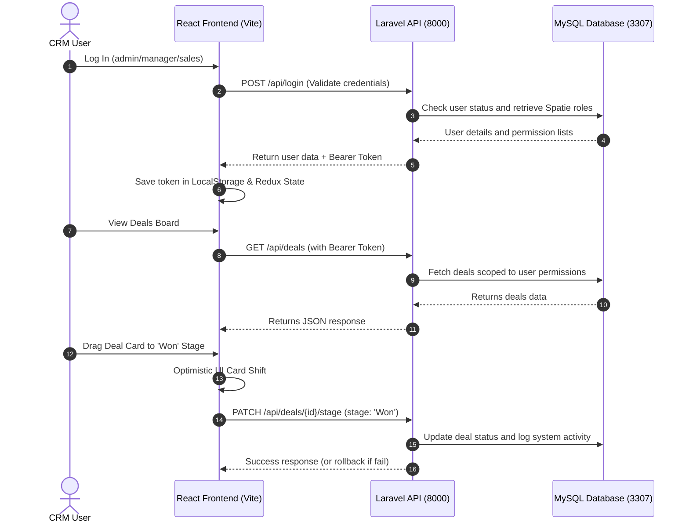
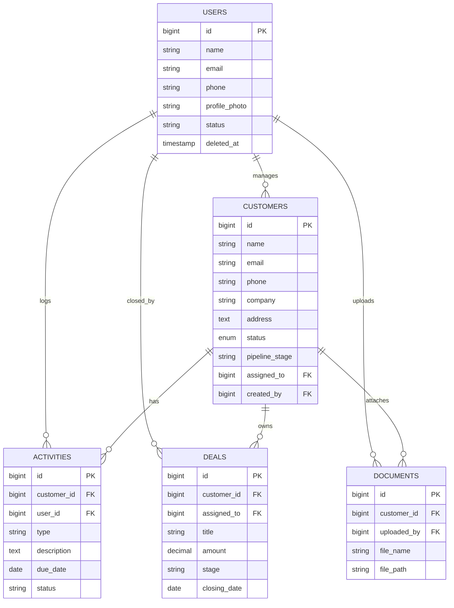

# Mini CRM System (Laravel 12 REST API + React 18 Vite SPA)

A premium, full-stack Customer Relationship Management (CRM) application built to help small-to-medium businesses organize leads, convert them to customers, manage sales deals via a drag-and-drop Kanban board, track client interaction timelines, store documents, and review team performance with dynamic exports and dashboards.

---

## 1. System Architecture & Flow

The system employs a decoupled architecture consisting of a PHP Laravel REST API backend, a MySQL database, and a React SPA frontend styled with TailwindCSS.

### 🔄 System Flow Diagram



---

## 2. Key Features

### 🎨 Creative Theme Selector
The application has a premium built-in **Theme Engine** supporting 4 distinct themes that persist in `localStorage` across page reloads:
*   **Dark (Default):** Deep slate-blue theme with electric blue accents.
*   **Light:** Crisp clean white/light grey theme with soft shadows and dark slate high-contrast typography.
*   **Cyan:** Cyberpunk-inspired teal and cyan theme.
*   **Emerald:** Forest organic green theme with emerald accents.

### 🔑 Robust Role-Based Access Control (RBAC)
Using Spatie Laravel Permissions, the CRM divides functionality among three distinct roles:
1.  **Admin (e.g., Rohit Sharma):** Full system access. Can perform full CRUD on customers, deals, and activities. Exclusive access to delete records, manage user accounts (create reps, change status, assign roles), and view team performance reports.
2.  **Manager (e.g., Priya Verma):** Access to view and manage all customer records, log activities, and track deals. Can reassign customers/leads to different reps. Full access to Reports. Cannot delete records or manage user accounts.
3.  **Sales Executive (e.g., Amit Kumar / Neha Singh):** Can only view, edit, and manage customers, leads, activities, and deals explicitly assigned to them. Users and Reports panels are hidden from their dashboard.

### 📊 Interactive Dashboard & Analytics
*   **Aggregated Metrics:** Real-time summary cards for Total Customers, Active Leads, Total Closed Revenue, Won/Lost Deals, and Open Pipeline.
*   **Monthly Revenue Trend:** Dynamic line chart built with Recharts displaying month-over-month revenue generated during the calendar year.
*   **Pipeline Split:** Pie chart showing lead stage distributions.
*   **Quick Follow-ups Tracker:** Lists pending tasks/calls with one-click completion trigger directly from the dashboard.

### 👥 Client & Leads Pipelines
*   **Filter, Search & Sort:** Server-side pagination with real-time text query searching, status filtering (Leads, Customers, Inactive), and column sorting (Name, Company, Status, Assigned To).
*   **One-click Lead Conversion:** Leads panel lets Sales Executives or Managers instantly convert a warm lead into a Customer with a dedicated `PUT /api/leads/{id}/convert` action.
*   **Unified Client Details Modal:**
    *   **Follow-ups Timeline:** Chronological timeline tracking client interactions (calls, meetings, emails, notes).
    *   **Document Vault:** Multi-file attachment system validating PNG, JPG, PDF, or DOCX formats under 5MB. Support for uploading, downloading, and deleting files.
    *   **Deals Linker:** Track sales opportunities specifically linked to this customer.

### 🗂️ Drag-and-Drop Deals Kanban
*   Interactive board grouped into 5 sales stages: *Prospecting, Qualification, Negotiation, Won, Lost*.
*   Powered by `@dnd-kit/core` with custom collision sensors.
*   Optimistic state updates: cards move instantly for a lag-free experience, automatically reverting with a notification toast if the network request fails.

### 📈 Analytics & Exports
*   **Excel Export:** Generates formatted `.xlsx` spreadsheets mapping customer databases using Maatwebsite Excel.
*   **PDF Export:** Compiles a formatted deal report detailing team sales metrics using DomPDF.
*   **Unread Alerts:** Header bell icon with real-time unread notification counts and mark-as-read updates.

---

## 3. Database Schema Design

The MySQL database contains tables structured to handle CRM resource relations:



---

## 4. Setup & Installation Instructions

Follow these steps to run both the Laravel backend and React frontend local servers.

### 📋 Prerequisites
*   PHP >= 8.2 with Composer installed.
*   NodeJS >= 18 with npm installed.
*   MySQL/MariaDB running locally (configured for port **3307** by default).

---

### 🖥️ Step 1: Backend API Configuration
1.  Navigate into the `backend/` directory:
    ```bash
    cd backend
    ```
2.  Install composer dependencies:
    ```bash
    composer install
    ```
3.  Configure your environment parameters. Copy `.env.example` to `.env` and verify the settings:
    ```ini
    DB_CONNECTION=mysql
    DB_HOST=127.0.0.1
    DB_PORT=3307
    DB_DATABASE=mini_crm_db
    DB_USERNAME=root
    DB_PASSWORD=

    # CORS and SPA domains
    FRONTEND_URL=http://localhost:5173
    SANCTUM_STATEFUL_DOMAINS=
    SESSION_DOMAIN=null
    ```
4.  Run database migrations and seed the mock accounts/roles:
    ```bash
    php artisan migrate:fresh --seed
    ```
5.  Link the storage directory (crucial for documents and profile photo uploads):
    ```bash
    php artisan storage:link
    ```
6.  Start the Laravel local server:
    ```bash
    php artisan serve
    ```
    *The API will run at `http://127.0.0.1:8000`.*

---

### 💻 Step 2: Frontend React Configuration
1.  Navigate into the `frontend/` directory:
    ```bash
    cd ../frontend
    ```
2.  Install dependencies (include `--legacy-peer-deps` to bypass Vite 8 conflicts):
    ```bash
    npm install --legacy-peer-deps
    ```
3.  Start the Vite developer server:
    ```bash
    npm run dev
    ```
    *The SPA will run at `http://localhost:5173`.*

---

## 5. API Reference Guide

All requests require the header `Authorization: Bearer <token>` unless stated otherwise.

### 🔑 Authentication API
*   `POST /api/register` (Public) - Create a new user (assigns Sales Executive role by default).
*   `POST /api/login` (Public) - Validates email/password and returns user details along with Bearer token.
*   `POST /api/logout` - Revokes bearer token.
*   `GET /api/user` - Fetches authenticated user info, permissions, and roles.
*   `PUT /api/profile` - Edits profile settings.
*   `POST /api/profile/photo` - Uploads profile avatar photo.

### 👥 Customers & Leads API
*   `GET /api/customers` - Returns paginated customers (with search, sort, and status filters).
*   `POST /api/customers` - Creates a new customer.
*   `GET /api/customers/{id}` - Returns deep details of a customer including their activities, deals, and documents.
*   `PUT /api/customers/{id}` - Updates customer profile.
*   `DELETE /api/customers/{id}` (Admin only) - Deletes customer.
*   `GET /api/leads` - Returns customers where `status = lead`.
*   `PUT /api/leads/{id}/convert` - Converts a lead to customer status.

### 💼 Deals & Timeline API
*   `GET /api/deals` - Lists all sales opportunities.
*   `POST /api/deals` - Link a new deal to a customer.
*   `PATCH /api/deals/{id}/stage` - Drag-and-drop callback to change deal column stage.
*   `POST /api/activities` - Logs a new timeline call, meeting, note, or email.
*   `PUT /api/activities/{id}` - Complete pending follow-up.

### 📊 Documents & Reports API
*   `POST /api/documents/upload` - Uploads client attachment (max 5MB).
*   `DELETE /api/documents/{id}` - Deletes client attachment.
*   `GET /api/reports/sales-performance` (Admin/Manager only) - Returns rep sales stats table.
*   `GET /api/reports/export/excel` (Admin/Manager only) - Downloads excel client spreadsheet.
*   `GET /api/reports/export/pdf` (Admin/Manager only) - Downloads deals PDF file.

---

## 6. Seeded Demo Accounts (For Fast Testing)

Use these credentials to test the application:

| Role | Email | Password | Allowed Access Features |
| :--- | :--- | :--- | :--- |
| **Admin** | `admin@minicrm.com` | `password123` | Users Panel, Delete anything, Reports, Leads pipeline, Kanban, Uploads |
| **Manager** | `manager@minicrm.com` | `password123` | Reassign Reps, Reports, Leads pipeline, Kanban, Uploads (No deletes, No users panel) |
| **Sales Executive** | `sales1@minicrm.com` | `password123` | Own data access only, Leads, Kanban, Uploads (No reports, No users, No reassignment) |
